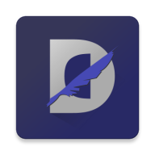
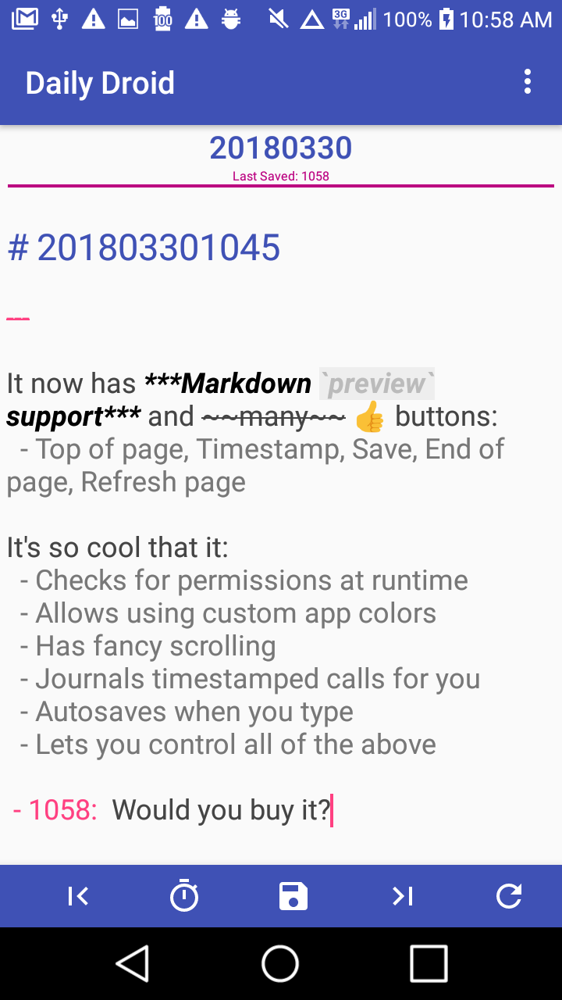

#  Daily Droid

*The personal journaling app for Android*

Built from the ground up as nothing more than a simple text editor with some quick shortcuts focused on timestamps and document navigation. It's no Vim, but it gets the job done!

## Features
- Basic file management
- Timestamping
- Autosaving
- Automated file naming
- Markdown syntax support
- Automated call logging
- Preset file coloring
- Dark theming and Night Mode support
- Simple and complex UI configuration
- Exporting and managing app preferences, colors, settings
- *NIX hidden file support

## TODOs
- Portability Improvements
  - Desktop/Landscape mode
    - Fix full-screen text area and keyboard issues
  - Include common keyboard commands
    - `^n` New file
    - `^o` Open file
    - `^s` Save file
    - `^z` Undo?
    - `^y` Redo?
  - Make assigned colors and app properties for files portable
   - Read config JSON from text file
   - Apply valid properties to app instance
  - Phone number compatibility with Google Voice?
- Functionality Updates
  - Auto-create monthly and yearly summary
  - Create your own text file
  - Have option to load UD files in alphabetical order
    - Settings switch
    - ON: UD files have higher alphabetical order
    - OFF: App-generated files have higher order
    - Create UD folder and have it loadable
  - Fix navigation buttons timing
    - Three taps replaced with long, holding tap
  - Grep and file searching
  - Auto-log text messages and phone calls at end of day
    - Separate options in settings activity
